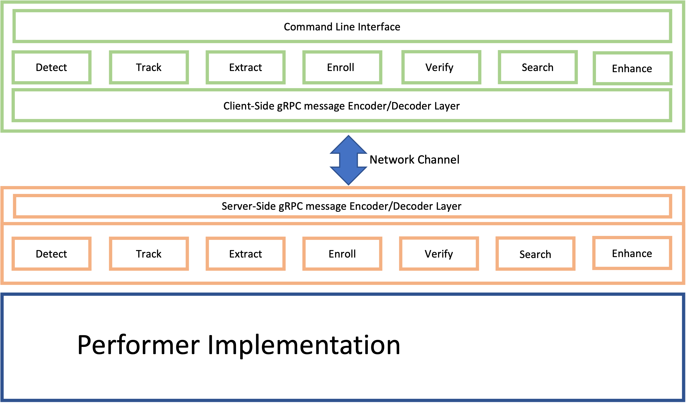

# BRIAR API
## Authors

| Name         | Organization                  |
| -----------  | ----------------------------- |
| David Bolme  | Oak Ridge National Laboratory |
| Joel Brogan  | Oak Ridge National Laboratory |
| Ryan Shivers | Oak Ridge National Laboratory |

## Table of Contents
 <!-- * README (Manual)
   * [Overview](#overview)
   * [GRPC Interface](#grpc-interface)
     * [Main Components](#main-components)
     * [Stubs and Services](#stsubs-and-services)
     * [Protobuf Documentation (html)](#protobuf-documentation)
   * [Language Support](#language-support)
   * [Installation](#installation)
   * [Developing a BRIAR Service](#developing-a-briar-service-that-communicates-with-the-api)
 -->

[[_TOC_]]




## Overview

The BRIAR Application Programming Interface (API) defines a unified protocol that allows performer teams on BRIAR to conform their research algorithms to a small set of high-level functions. Performers will implement a particular set of high-level functions that take specific input and output formats. These high level functions include:
  * Detection
  * Tracking
  * Extraction
  * Verification
  * Enrollment
  * Search
  * Enhancement

This unified interface will allow for uniform and fair testing and evaluation of each algorithmic solutions across different BRIAR performers, while also providing a simple and straight-forward way of interacting with algorithms both programmatically and through a Command Line Interface (CLI).

The BRIAR API is implemented using the [google Remote Procedure Call (gRPC) framework](https://grpc.io/) (https://grpc.io/). The BRIAR API uses this paradigm to interact with performer implementations via a **Client-Server Interface**, where performers' implementations of algorithms comprise a **Server**, while a pre-implemented API comprises the **Client**.  In this way, the BRIAR Client can seamlessly interact with algorithms written in many different languages. To accomplish this, a set of protobuf messages are defined that can be passed between the client and server as requests and responses to different function calls. *All performers must do is implement code for each function that accept input and generate output in the form of these messages.*

This Repository contains 3 main components:
  * lib/python -> a python implementation of a fully functional CLI client to interface with BRIAR performer algorithms
      * lib/python/briar_client.py -> a fully functional Python API that allows for calling functions in BRIAR performer algorithms
      * lib/python/cli/* -> function call implementations using the API that provide interaction via the command line
  * proto/briar/briar_grpc -> protobuf files that define the messages and services that comprise the BRIAR API

## Run tests against your Implementation!
simply run:

`python -m briar.tests.integration_test`

`python -m briar.tests.validation_test`

or, to generate BEAUTIFUL HTML reports of the test outputs:

`python -m briar.tests.integration_test_report > integration_test.html`

`python -m briar.tests.validation_test_report > validation_test.html`

## Change Log

 * Version 1.0.1 (May 2022)
   * Add modality to detections
   * Expanded modality list.
   * Updated the structure of the Template message to support more complex multimodal templates.
   * Updated search request documentation.


## gRPC Interface

### Main Components
gRPC is a proto-language that defines a **service** which contains multiple **functions** that each pass strictly defined **messages** back and forth.  **Messages** can be thought of as class definitions, and are defined to have strongly-typed **fields**.  These **fields** can either be primitive types, or other messages themselves. The files that define the proto structure for BRIAR are located in [proto/briar/briar_grpc](proto/briar/briar_grpc)

### Stubs and services
A special compiler called **Protoc** can compile gRPC **Services**, along with their subsequent **functions** and **messages**, down into a large selection of different languages.  Once the language is chosen, the Protoc compiler provides an **abstract service implementation** and its **unimplemented functions** in that language, that can be subclassed by performers as they build their service.  The Protoc compiler also provides a **client stub** of that given language which connects to an instance of the **service implementation** to allow you to make function calls. The BRIAR API and CLI utilizes a compiled Python stub to make calls to one of these services.

### Protobuf Documentation
We have compiled auto-generated [documentation](/doc/stubs) based on protobuf doc strings.  These can be located for each of our supported languages at [proto/briar/briar_grpc/doxyfile-stubs-*](proto/briar/briar_grpc/)

To learn more about gRPC, you can read the documentation at this link: <https://grpc.io/docs/what-is-grpc/introduction/>


## Language Support

While the client and command line tools are written in python, as well as the example service, the API is designed to work with any language supported by gRPC. This is done through the use of language agnostic gRPC messages which are used to communicate between the **client** (where commands are invoked) and the **service** (where commands are processed). This communication layer is cross-platform, cross-language, and can be used to communicate across networks so the client and service need not reside on the same system.

A list of supported gRPC languages can be found here: <https://grpc.io/docs/languages/>

As stated above, because communication between the client and service relies on the gRPC communication protocol, so long as you conform to using said protocol and the messages designated with the protobuf files, the service can be written in any supported language. Furthermore, multiple clients and services could theoretically all be written in different languages, such as having four services written each in Python, C#, C++, and PHP and all four would be able to communicate within the larger 'BRIAR ecosystem'.

While a mostly bare python example service is given, it is expected that performers be able to implement their detection/identification algorithms within their own service in whatever supported language they choose using the gRPC communication layer as an API. A fully functioning python client is provided to act as an interface with any service which a performer may create; however, while unnecessary because the python client is intended to be feature complete and extendable, there is nothing stopping a potential developer from writing their own client in a language of their choice using the provided gRPC stubs.

## Installation

### The fast version...

```bash
conda create -n briar python=3.12 anaconda conda-forge::doxygen
conda activate briar
python -m pip install -U -e .
./build-proto-stubs.sh
./build-proto-docs.sh
```

### The longer version...

These instructions will set up the API and command line and will establish a python development environment for using the API. If you are using another language, additional steps may be required to add the pre-generated gRPC stubs (found in lib/[language_name]) to incorporate them into your development environment


1. (Optional) Use a conda environment
   1. Create a conda environment with `conda create --name briar`
   2. Activate the environment with `conda activate briar`

If you do not wish to create an anaconda environment, start here:

1. Clone the repo at https://code.ornl.gov/briar1/briar-api
   1. If you do not have permission to view the repository, contact the repository's maintainer at <bolmeds@ornl.gov>
2. Navigate to the repository python lib folder in a terminal at: ` briar-api/lib/python/briar/ `
3. Install the python dependencies: ` pip install -r requirements.txt `
4. Return to the repository's root directory
5. Build the protobuf stubs: `./build-proto-stubs.sh`
   1. May need to make the script executable : `chmod +x ./build-proto-stubs.sh`
6. Set the environment variables for BRIAR: `./briar_env.sh`
7. Install the python files: ` pip install -e .`


## Developing a BRIAR Service that communicates with the API
For instructions on how to develop BRIAR services that host your algorithms with the BRIAR API, please see [this document](doc/HowToDevelopBriarService.md).

### Using the Command Line Interface (Python Client)
The BRIAR CLI is implemented in python, and utilizes the Protoc-compiled python stubs to communicate with performer algorithms. This is the method of sending commands to the service. As shown in the overview figure of the BRIAR API, you can see this is done in two ways - through the Command Line Interface (CLI), or through the python client (which the CLI uses).

To use the CLI, In a terminal, run `python -m briar`. You will be provided with a selection of commands:

~~~
Commands:
    status - Connects to the server and displays version and status information.
    detect - Only run detection.
    extract - Run feature extraction.
    enroll - Extract and enroll biometrics in a database.
    search - Search database for media and IDs that contain biometric matches to the query.
    finalize - Finalize a database.
    sigset-stats - Convert a sigset to a csv file.
    sigset-enroll - Enroll a sigset in a database.
~~~

Run `python -m briar status` to check that you can establish a connection to the service. If you can, you will see a message similar to the following: 

~~~
===================== STATUS =====================
  Developer:   Oak Ridge National Laboratory
  Name:        Briar.Exmaple
  Alg Version: 1.2.0
  API Version: 1.2.5
  Status:      READY
==================================================
~~~

Note that the other commands representing BRIAR tasks have been intentionally left unimplemented.

This command line functionality is processed through the briar_client, which uses python to compose and send gRPC messages to services at specified network locations (default is localhost:50051 and can be specified with -p). If you wish to extend this functionality, the client can be used like any python module or else can be used as an example for creating your own in whatever language you choose.

## Usage

Before continuing, startup a BRIAR service implementation, otherwise the examples below will not work. If you do not have a BRIAR service implementation, please refer to [The BRIAR API Example](https://code.ornl.gov/briar-performers/briar-api-example). The Briar API example is a basic service which implements the BRIAR SDK and runs face and body detection and identification algorithms using the BRIAR API as a front end. 

In a different terminal, run `python -m briar`. You will be provided with a selection of commands:

~~~
Commands:
    status - Connects to the server and displays version and status information.
    detect - Only run detection.
    extract - Run feature extraction.
    enroll - Extract and enroll biometrics in a database.
    search - Search database for media and IDs that contain biometric matches to the query.
    finalize - Finalize a database.
    sigset-stats - Convert a sigset to a csv file.
    sigset-enroll - Enroll a sigset in a database.
~~~

Run `python -m briar status` to check that you can establish a connection to the service. If you can, you will see a message similar to the following:

~~~
===================== STATUS =====================
  Developer:   Oak Ridge National Laboratory
  Name:        Briar.Exmaple
  Alg Version: 2.0.0
  API Version: 2.1.7
  Status:      READY
==================================================
~~~

To run detections, run `python -m detect -v [image_filename]`, replacing [image_filename] with the path to an image file. You should see something like this:

~~~
Scanning for videos and images...
    Found 1 images.
    Found 0 videos.
Running Detect on 1 Images, 0 Videos
Detected 3 detections in 4.407133102416992e-06 seconds
Detected test_image.jpg in 4.407133102416992e-05s
Finished detect.
Finished 1 files in 4.552372455596924 seconds
~~~

If you need any help with any of the commands, each one is fully documented with help text which can be accessed with the '--help' flag. The help text can also be viewed [here](@ref doc/pdf/BRIAR-Commands.pdf).

The Briar API Example service can be run on any network enabled computer and can be accessed with the BRIAR command line tools over the network by specifying the IP and port as an argument like so `-p 192.168.1.100:50051`. Leaving the argument blank defaults to using localhost and port 50051.

Run multiple copies of the BRIAR API Example on a compute resource.  Make sure to use a different port.
`$ screen python  ./briar-example/service.py -w 1 -g 5 --port=127.0.0.1:50063`

### Sample Commands with the BRIAR API {#Main_SampleCmds}

1. Start the docker service in one line (example from the BRIAR API exmaple algorithm; each service may vary):
   - `docker run -e NVIDIA_DRIVER_CAPABILITIES=all --gpus all --shm-size=4g --net host -v storage:/briar/briar_storage --rm -it briar-example python ./briar-example/service.py -p 127.0.0.1:50051 -w 2 -g 0 --max-message-size=-1`
     - Change `-p` to match the IP address set by the BRIAR Example service. `--max-message-size=-1` denotes no maximum message size, which is useful for large images.
2. Detection on a video
   - `python -m briar detect -p 127.0.0.1:50051 <path_to_media>`
3. Enrolling an image
   - `python -m briar enroll -p 127.0.0.1:50051 --max-message-size=-1 ` `--name = <subject-name> --entry = <subject-id|media-id> --entry-type = <subject|media> --database = <database-name> <path-to-media>`
4. Finalize (save) a database to disk
   - `python -m briar finalize -p 127.0.0.1:50051 --database=<database-name>`
5. Search against a database
   - `python -m briar search -p 127.0.0.1:50051 --database=<database-name> <path-to-image> `
6. Whole-body tracking and enroll all detections along a track
   - `python -m briar enroll -p 127.0.0.1:50051 --name=<subject-name> --entry=<numeric-id> --track --database=<database-name> <path-to-video>`

## R&D Team Deliverables and Evaluation

Teams will submit software deliverables as docker and singularity container images.  Additional documentation can be found in [How To Develop a BRIAR Service](doc/HowToDevelopBriarService.md).

## Further Information

The documentation above is intended to provide a high level understanding of the service and client. However, this document does not go into fine detail, particularly pertaining to the service, how it works, and the details of creating your own. For more information, refer to the stubs and protobuf documentation in this repository's `doc` folder.

## IARPA Acknowledgement
This research is based upon work supported in part by the Office of the Director of National Intelligence (ODNI), Intelligence Advanced Research Projects Activity (IARPA), via Contract D20202007300010. The views and conclusions contained herein are those of the authors and should not be interpreted as necessarily representing the official policies, either expressed or implied, of ODNI, IARPA, or the U.S. Government. The U.S. Government is authorized to reproduce and distribute reprints for governmental purposes notwithstanding any copyright annotation therein.